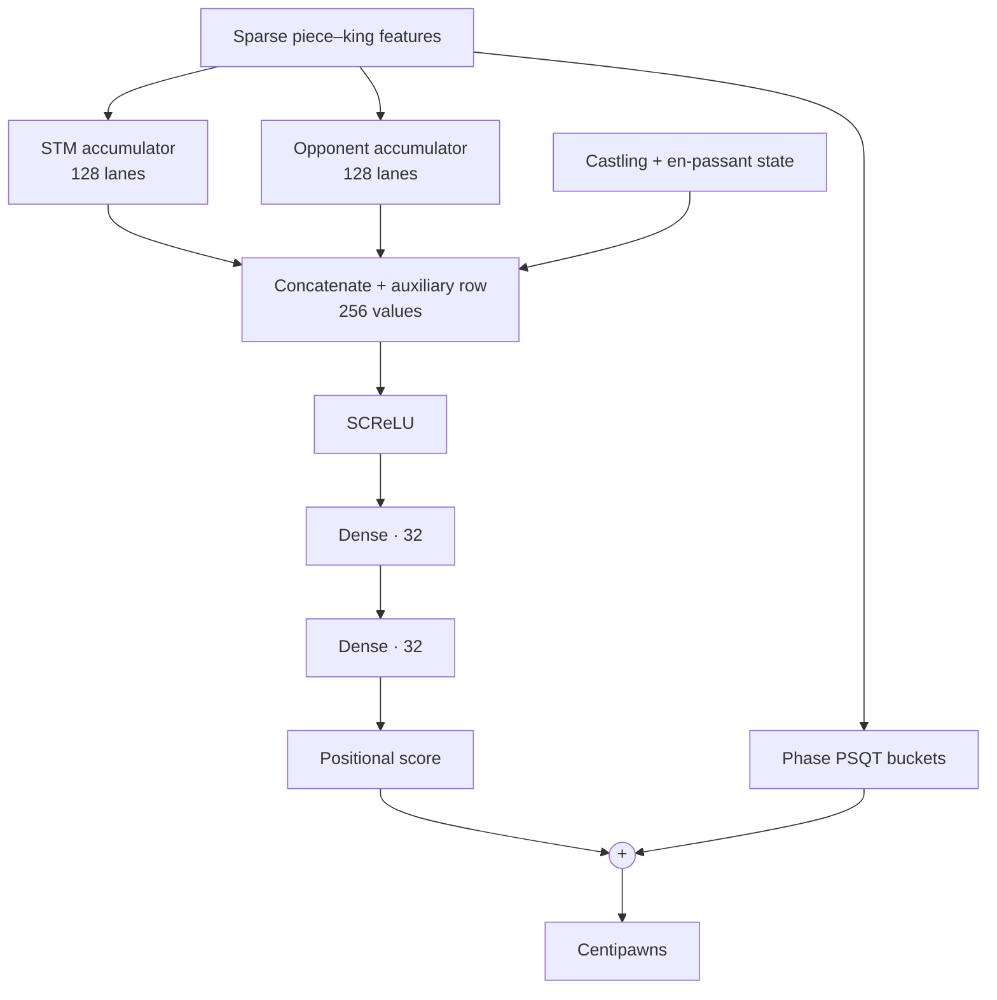

# Chess

A learning-oriented C++20 chess engine built from bitboards upward. The project
now includes a long classical-search lineage, phase-aware quantized NNUE,
selective V43 search, a UCI adapter, and a documented Lichess deployment.

V43 remains the production search core. Heroku release v20 provisionally uses
the V45 tournament-winning pruning profile
`28c848b51bd93c402e873a0154e1fc61c953efa683898dc4a67d1fecd5a76aa8`.
The operator promoted it on 2026-09-02 while its frozen 600-game confirmation
against the previous profile was still running. Heroku release v19, with
profile `98b7732c9587da35554cc274a072a0a5b5f55902aaa77605e78c1ae13e88b4f2`,
is the rollback anchor if the completed evidence reverses the result. This is
a provisional deployment, not a completed strength claim.

The earlier V43 promotion was also made before its frozen confirmation had
completed; that run was stopped at 421 games. Its 210 complete pairs scored
55.238% with a paired 95% interval of 52.059%-58.417% while using 95.607% of
the prior production nodes. See the
[V43 promotion report](docs/benchmarks/nnue_v43_production_promotion_20260901.md).
V41 remains an older production anchor, and V42 remains an experimental
adaptive-aspiration branch. The tuning and staged self-play artifacts are kept
for reproducibility.

The project goal is not to clone Stockfish directly. It is a staged engine
project for learning the core systems work behind chess engines: bitboards,
legal move generation, perft, search, evaluation, neural evaluation, profiling,
and production deployment.

This README is the thematic project story. The tracked
[benchmark index](docs/benchmarks/README.md) retains the versioned reports,
artifact hashes, negative experiments, and promotion-gate details that have
already been packaged for the repository.

## How milestone claims are classified

The repository deliberately keeps old searchers, benchmark tools, and negative
experiments. Each milestone claim therefore has two independent labels:

| Dimension | Typical labels | Question answered |
|---|---|---|
| Lifecycle | experimental, historically promoted, deployed, rejected | What did the project do with the change? |
| Evidence | validated, validated with caveats, reconstructed, incomplete, inconclusive | How strongly do the retained artifacts support the claim? |

These labels prevent a newer version or one isolated metric from being mistaken
for a stronger engine: lower model loss, fewer nodes, higher NPS, and playing
strength are different results. Interpreting a new performance or strength
claim requires pinned artifacts, workload, correctness signatures, and stopping
rule.

## Four project milestones

The project is easier to understand as four engineering milestones than as a
list of every searcher version. The version numbers still matter for
reproducibility, but each milestone marks a step change substantial enough to
redefine how the engine was designed, searched, evaluated, or trained, rather
than another incremental version.

| Milestone | Main question | Result |
|---|---|---|
| 1. Correctness, simple search, heuristic evaluation | Can the engine represent chess correctly and return a defensible move? | A legal bitboard engine, perft/tests, plain alpha-beta, and a material-plus-piece-square evaluator. |
| 2. Range-correct Strict search and clean optimization | How much search work can be removed while preserving the same fixed-depth score or a mathematically valid alpha-beta bound? | Bound-correct TT, PVS/re-search, ordering, fixed move storage, magic attacks, lazy/staged legality, make/unmake, and cache/layout work, with per-position score/move/node gates where evidence survives. |
| 3. Neural evaluation becomes both stronger and practical | Can an NN evaluator justify its much higher cost? | The historical NNUE beat the heuristic engine while searching one ply less; incremental accumulators and SIMD kernels then made NN inference production-viable. |
| 4. Controlled selective or “dirty” pruning | How aggressively can the engine prune unlikely moves without causing tactical blunders? | LMR, null move, RFP, LMP, and QSEE are filtered by cached Strict-teacher samples, two-stage Pareto selection, and progressively longer round-robin self-play. |

This README uses those four thematic milestones. The version names remain in
the source tree and Git history for finer-grained reconstruction; the four
groups here describe the engineering story rather than replacing those source
anchors.

## Detailed milestone history

### 1. Correctness, simple search, and a heuristic evaluator

The first milestone was not speed. It was building a position representation
that could be trusted.

The initial engine established:

- bitboards with `a1 = 0` and `h8 = 63`;
- FEN parsing and complete position state;
- pawn, knight, king, sliding, and occupancy-dependent attacks;
- pseudo-legal and legal move generation;
- castling, en passant, promotion, check, and legal handling of pinned-piece
  cases;
- `make_move` and known-count perft validation;
- material and piece-square evaluation;
- plain negamax alpha-beta search.

The code deliberately favored simple, easy-to-check implementations.
Performance optimizations came only after move generation and board updates
consistently passed perft and chess-rule tests.

The evaluator was intentionally understandable:

**Heuristic score = material balance + piece-square terms**

One chess point is represented as 100 centipawns (`cp`). The base material
values in the original evaluator were:

| Piece | Chess shorthand | Engine value |
|---|---:|---:|
| Pawn | 1 point | 100cp |
| Knight | 3.2 points | 320cp |
| Bishop | 3.3 points | 330cp |
| Rook | 5 points | 500cp |
| Queen | 9 points | 900cp |
| King | Not exchangeable | 0cp in static material |

The king does not need a capture value in normal evaluation because a legal
game ends at checkmate rather than with the king being captured. Checkmate is
therefore represented by the search as a separate terminal score, not as the
material value of a king.

Material alone would consider every square equivalent. The piece-square table
(`PST`) adds a small handcrafted bonus or penalty according to where each
piece stands. For example, a knight in the center can receive `+20cp`, while a
knight in a corner receives `-50cp`. The table is mirrored by color, so White
and Black receive the same preference from their own perspective.

Conceptually, the calculation was:

| Quantity | Calculation |
|---|---|
| Piece contribution | Base piece value + `PST[piece][relative square]` |
| White score | Sum of White contributions − sum of Black contributions |
| Side-to-move score | White score if White moves; otherwise, its negation |

Thus winning an otherwise equal rook changes the score by roughly `+500cp`,
whereas improving a knight's square might change it by only a few dozen
centipawns. This evaluator did not directly understand mobility, pawn
structure, threats, long-term king safety, or game phase beyond what the fixed
tables happened to encode. Alpha-beta search supplied tactical correction by
looking ahead; the heuristic supplied the leaf score when that lookahead
stopped.

It was fast and deterministic enough to be a useful correctness baseline and
search-control oracle. The simple alpha-beta tests compared its score with a
small full-negamax reference suite and checked that the returned move realized
that score. They did not establish identical node counts or a unique best move
when several moves tied.

This correctness-first core remains the foundation under every later Strict,
NNUE, and selective searcher.

### 2. Range-correct Strict search and clean optimization

The project uses **Strict** for a correctness/debug line intended to make
fixed-depth comparisons and score bounds easier to reason about while data
structures and hot paths change. It is an engineering intent, not a claim that
every historical Strict version has already been proven behavior-identical.
“Clean pruning” is useful shorthand, but there are three technically different
things inside this milestone:

1. **Proven cutoffs:** alpha-beta and valid TT bounds can skip a subtree because
   the current window already proves it irrelevant.
2. **Work reduction without dropping moves:** move ordering, fixed move lists,
   magic attacks, cached state, and staged/lazy legality retain the legal move
   space and score contract while reducing implementation work. Ordering and
   proof cutoffs may still change which nodes are visited.
3. **Correct re-search protocols:** PVS and aspiration may search a narrow
   window first, but re-search when the narrow result is insufficient.

These are different from milestone 4, where a heuristic intentionally decides
that a move probably does not deserve a full search.

V2-V13 were an exploratory search laboratory and already tried quiescence,
LMR, null move, PVS, history, and killers. Not all of those experiments were
behavior-preserving. V14 made bound behavior explicit; V15 introduced the
range-storing, exact-depth hand-written Strict line. V16-V33 and V35 then
concentrated the controlled TT, ordering, move-generation, state, and layout
work within this line. V34 branched into the Fast line to test a compact
single-bound TT with `AtLeast` depth reuse: a deeper result may accelerate the
search, but it is not guaranteed to equal the score requested at the shallower
fixed depth.
Aggressive LMR/null-move tuning is treated separately in milestone 4.

#### What “exact behavior” means in this repository

A fair Strict comparison pins the corpus, depth mode, compiler, flags, TT size,
and starting heuristic state, then checks the result per position:

- score equality is the primary semantic gate;
- tied-optimal moves must be handled explicitly before claiming best-move
  equality;
- node equality is not part of the Strict contract; it is required only before
  claiming the same node count or using equal nodes to isolate per-node speed;
- timing is interpreted only after the score contract and workload relationship
  are known.

The main Strict benchmark series therefore excludes V34. It may appear as a
separate Fast/experimental comparison, but its time, nodes, and NPS describe a
different fixed-depth computation and cannot be presented as a clean Strict
speedup.

#### Measured Strict milestone progression


#### How the benchmark was run

Every version searched the same 25 positions directly at fixed depths 6, 7,
and 8. For each `(depth, round, leg, position, version)` tuple, the harness
constructed a fresh 64 MiB searcher state outside the timer and measured only
the in-process `search_best_move` call. Eight Williams-balanced forward/reverse
rounds controlled execution-order effects, and every timed result had to match
V15's score, return a legal move, reach the requested depth, and finish without
stopping. The chart reports pooled depth-7 wall time from the same Apple M4
Release + ThinLTO build. All 9,600 timed searches passed; the six unique move
differences were force-verified as score-equivalent ties.

#### What each measured version introduced

Because the selected checkpoints skip intermediate versions, each row reports
only the accumulated change since the previous measured checkpoint.

| Version | Main improvement | Move ordering |
|---|---|---|
| V15 | Baseline: hand-written Strict search with exact-depth range TT. | Baseline weighted ordering: preferred TT move, promotions, SEE, history, checks, and two killers. |
| V19 | Bucketed range TT, cached king safety, and legality filtered while scoring pseudo-legal moves. | Separately weight the lower/upper TT moves and add counter-history. |
| V23 | **Two-stage lazy move generation.** | Search the lower TT move first; generate noisy moves next and quiet moves only if still needed. |
| V25 | Fixed-capacity raw storage replaces heap-backed scored-move vectors. | Replace noisy/quiet stages with a priority stage for promotions and non-losing captures, followed by quiets and deferred losing captures. |
| V27 | In-place make/unmake with undo state and RAII replaces child-position copies. | No deliberate ordering change. |
| V29 | Dedicated legal callbacks complete **fully staged lazy move generation**. | Split the remaining moves into four on-demand stages: promotions → good captures → quiet moves → bad captures. |
| V30 | `ScoredMove` is packed from 16 to 8 bytes and the templated search hot path is rewritten. | Replace qsearch SEE ordering with cheaper victim/attacker scoring; main-search stages are unchanged. |
| V35 | Compact 12-byte TT preserves score ranges and exact-depth reuse. | Insert a priority quiet stage for two killers and the countermove before general quiet moves. |

These labels explain why each checkpoint was selected. The measured difference
between two rows still includes every accumulated change between them; it is
not an isolated one-feature A/B.

- **Interpretation:** elapsed time is primary and NPS explains per-node cost.
- **Provenance:** these are stable current-tree reconstruction results, not
  timings from the original historical binaries.

### 3. Neural evaluation becomes stronger and fast enough to use

#### Why I initially doubted the NN

I was initially skeptical that a neural evaluator was worth its cost. The
heuristic evaluator was extremely cheap, easy to debug, and already expressive
enough to describe material and many positional ideas. A neural evaluator is
called throughout the search tree, so a slow forward pass can erase any gain
from a better position score.

Early scalar inference reinforced that concern. The turning point was not just
training a model with lower loss. It was the combination of:

- a model that made better positional decisions;
- incremental features, so most moves update a few rows instead of rebuilding
  the whole input;
- quantized arithmetic;
- architecture-specific dot-product intrinsics.

Those changes made NNUE fast enough to use, but it was still much more
expensive per searched node than the heuristic evaluator. The remaining
question was whether better leaf evaluations could repay that cost.

#### The throughput trade-off

On the local Apple M4, a clean Release + ThinLTO benchmark used 12 fixed
positions at depth 6, eight order-balanced processes per engine, and 15
repetitions per process. With a fresh 64 MiB searcher for every timed position,
heuristic V35 reached **19.62M NPS** while the historical `hs2x8_os128` V36
NNUE reached **7.37M NPS**. NNUE therefore retained 37.6% of the throughput: a
**62.4% drop**, or 2.66× as much time per searched node.

This is end-to-end search throughput, not an isolated evaluator benchmark:
the two evaluators assign different scores and therefore explore different
trees. NPS measures how many positions are visited, not how useful each leaf
evaluation is. The match below tested whether the richer NNUE evaluations
could compensate for searching fewer positions.

#### First match win over the heuristic engine

Across 200 games, the historical `hs2x8_os128` NNUE at depth 3 scored
**56.0%** against `HeuristicSearcherV35` at depth 4: 46 wins, 132 draws, and
22 losses, with a nominal paired 95% interval of 52.75%-59.25%. It searched
29.0M nodes in total, compared with 79.2M for the heuristic engine.

That result changed the project direction: the NN won while searching one ply
less and visiting only 36.7% as many total nodes. Under this protocol, its
better leaf evaluations more than compensated for the lower throughput. The
ordinary interval was inspected every five pairs and the run used an early-stop
rule, so it is directional historical promotion evidence, not a modern
sequential Elo proof. The winning model was also an older artifact, not the
current production model described below.

See [the full NNUE-vs-heuristic result](docs/nnue_vs_heuristic_result.md).

#### How the NN works

##### Phase-aware F2 architecture

The board is encoded as sparse feature indices instead of a dense tensor. For
each active piece and king perspective, the encoder records:

| Feature component | Possibilities |
|---|---:|
| Piece type | 6 types |
| Piece side relative to perspective | 2: friendly or enemy |
| Perspective king square | 64 squares |
| Piece square | 64 squares |

This gives `6 × 2 × 64 × 64 = 49,152` possible feature rows. The same
table is shared by the side-to-move and opponent perspectives. Each active row
contributes 128 values to its perspective accumulator; the two accumulators are
then concatenated into 256 dense inputs.

Thirteen auxiliary inputs encode castling rights, en-passant availability, and
the en-passant file without creating another large sparse table.



Other architectural details:

- eight material-phase dense heads;
- eight PSQT buckets accumulated alongside the positional rows;
- king moves rebuild only the affected king perspective;
- ordinary moves incrementally add/subtract feature rows;
- `int8` weights with wider accumulators and bit-exact scalar/SIMD parity;
- production scales `(hidden2=2, hidden3=8, output=128)`, clip `181`, and
  SCReLU divisor `128`.

##### The NEON kernel made the model operational

The hot mixed-sign dot product maps directly to the ARM NEON/I8MM intrinsic
`vsudotq_laneq_s32` (the `SUDOT` instruction).

It multiplies unsigned activation bytes by signed weight bytes and accumulates
the products into `int32` lanes. The ARM kernel is compiled natively with NEON,
dot-product, and I8MM support, while the scalar reference remains the bit-exact
correctness oracle.

The standalone NNUE prototype went through many small kernel experiments, but
those implementation checkpoints are not promoted to project milestones here.
The important progression was architectural: map quantized inference to native
mixed-sign dot products, keep SCReLU and dense accumulation vectorized, and
decompose wider activations into low/high byte banks that the same dot-product
instructions can consume.

Microbenchmarks decided which implementations survived. Several intuitive
manual pipelines, paired-load loops, and algebra rewrites were neutral or even
slower because they increased dependency chains or forced accumulator spills.
That negative evidence is useful engineering history, but the main milestone
is the resulting bit-exact NEON kernel rather than every intermediate rewrite.

#### Training data

Each training position needed a target evaluation score. I first tried
generating those labels with the classical evaluator plus shallow search. That
approach failed on both scale and label quality. Training at a useful scale
required hundreds of millions of labeled positions, and search would have to
be repeated independently for every label. As a rough scale, the V35 depth-7
benchmark took 20.334 seconds for 400 searches on the local M4, or about
50.8 ms per position. At that rate, labeling 100 million positions would take
about 59 days of uninterrupted single-process search; 200 million would take
118 days, and 500 million about 294 days. Position difficulty varies, but the
order of magnitude made laptop-generated search labels impractical.

The classical teacher also struggled to express long-term benefits such as
castling, open files, and sound pawn structure. I therefore switched to the
RobotMoon Stockfish binpack corpus, whose positions already carried raw
Stockfish search scores from the side-to-move perspective. This provided a
much stronger teacher without spending months generating labels on the laptop.

### 4. Selective (“dirty”) pruning

Strict search skips a subtree only when alpha-beta bounds prove that it cannot
change the fixed-depth result. **Dirty pruning** also skips or reduces work
that merely looks unlikely to matter. This can make the engine much faster,
but it can also change the score or miss the best move.

#### What was pruned

| Technique | Plain-language idea |
|---|---|
| LMR | Search late quiet moves at a lower depth, then search them fully if the reduced result looks promising. |
| Null-move pruning (NMP) | Pretend the side to move passes; if the position still looks good enough, cut off the node. |
| Reverse futility pruning (RFP) | At shallow nodes, stop when the static evaluation is already far above the required bound. |
| Late-move pruning (LMP) | After enough moves have been tried, skip the remaining ordinary quiet moves. |
| Quiescence SEE pruning (QSEE) | Skip captures that appear to lose too much material, while retaining checks, promotions, and evasions. |

These shortcuts can miss late quiet tactics, sacrifices, or zugzwang. They
therefore could not be accepted from an NPS improvement alone.

#### How candidates were selected

V45 replaces the older fixed candidate funnel with a steady-state pipeline.
It deliberately does not reserve a separate “safe” configuration: production
V43 is the control, while the search budget is spent exploring mutations that
can improve the active frontier.

1. **Mutate and screen.** Start from the production configuration, uniformly
   choose a parent from the current tune Pareto frontier, and mutate one grid
   step (normally one parameter block, occasionally two). Run a cheap fixed
   sample first. The current run rejects an offspring immediately if its total
   node count exceeds `2.0x` production V43.
2. **Update the tune frontier in both directions.** Evaluate each survivor on
   the full tune split using mean Strict-teacher WDL loss and total candidate
   nodes as the two objectives. Reject the offspring if any active member
   dominates it. Otherwise insert it and remove every active member that it
   dominates. Every evaluated configuration is still archived, so rejection
   does not destroy evidence.
3. **Reselect on fresh data.** Freeze the Stage 1 frontier, evaluate every
   member once on a fresh selection split, apply the node cap again, and build
   a new Pareto frontier. This split is never fed back into mutation; keeping
   it one-way prevents the “fresh” sample from quietly becoming more tune
   data.
4. **Let self-play choose.** Put the Stage 2 frontier, including production
   V43, into a serial round-robin tournament. Approximately half the field is
   removed after each round. Later rounds use more games per pair and longer
   time controls because the remaining decisions are closer and more
   important.

The current tournament contract is:

| Round | Entrants -> survivors | Games per pair | Time control | Round games |
|---|---:|---:|---:|---:|
| 1 | 17 -> 9 | 8 | `1s + 0.01s` | 1,088 |
| 2 | 9 -> 5 | 16 | `3s + 0.03s` | 576 |
| 3 | 5 -> 3 | 32 | `5s + 0.05s` | 320 |
| 4 | 3 -> 2 | 64 | `7s + 0.07s` | 192 |
| 5 | 2 -> 1 | 128 | `10s + 0.10s` | 128 |

That is 2,304 tournament games. Each opening is played with reversed colors,
and every round receives a fresh, disjoint opening set. If a challenger wins,
it then plays a separate 600-game confirmation against production V43. Neither
the tournament nor confirmation promotes a configuration automatically; the
artifacts are left for human review.

The implementation is designed for unattended laptop runs. Immutable
Strict-teacher root caches are fingerprinted and reused once per evaluation
rung instead of regenerated for each candidate. Evaluations omit large detail
sidecars and bootstrap matrices, reduce worker count when free memory is low,
enforce a disk-space floor, and retry an isolated evaluation failure once with
a single worker. Batch plans, decisions, games, manifests, and status are
written incrementally, making both tuning and self-play resumable without
silently changing their inputs. The entry points are
`tools/run_nnue_v45_pareto_tune.sh` and
`tools/run_nnue_v45_round_robin.sh`.

V40 later added QSEE at `-75cp`. On its depth-8 holdout this reduced nodes by
`15.50%` and time by `11.36%`; a 600-game match scored `52.0%` with an interval
that still included 50%, so it was adopted for efficiency rather than proven
strength. V41 then added repetition, 50-move, and history-sensitive TT
correctness guardrails around the selected search.

### Evidence discipline and negative results

The milestone story intentionally retains results that did not become wins:

- V18/V19's historical timing ratio is not presented as exact-tree proof;
- the V39 all-four offline candidate lost its direct match to Fast;
- V40 QSEE improved efficiency but not conclusively playing strength;
- the ordinary 500M F2 candidate scored `47.08%` against the older 200M
  reference over 600 games and was rejected;
- horizontal mirroring improved controlled offline error, but the longer F2M
  self-play run scored `50.92%`, with CI `48.39%-53.44%`, and did not
  demonstrate a playing-strength improvement. No F2M model was promoted.

The model-scaling experiments remain documented in the
[model-scaling report](docs/benchmarks/nnue_model_scaling_20260825.md), but they
are not a project milestone because they did not improve the deployed engine.

## Running on Lichess 24/7

I chose Heroku so the bot could keep accepting Lichess games without depending
on my laptop being awake. That deployment exposed a new portability problem:
the local Apple M4 used the ARM NEON/I8MM kernel, while Heroku ran on an x86
Xeon host and could not execute those instructions.

The first x86 release therefore fell back to scalar NNUE inference. It reached
only about `0.24M` fixed-depth NPS, and the NNUE forward pass consumed 89.15%
of sampled search CPU. To make the hosted bot practical, I added separate,
bit-exact AVX2 and AVX-512 VNNI kernels. A single binary now selects VNNI when
available, then AVX2, and finally the scalar fallback.

On the same Heroku dynos, the x86 backends produced identical fixed-depth
scores, moves, and node counts:

| Heroku backend | Depth-7 NPS | Depth-8 NPS |
|---|---:|---:|
| Scalar | 0.241M | 0.243M |
| AVX2 | 1.022M | 1.053M |
| AVX-512 VNNI | 1.467M | 1.558M |

VNNI was **6.1–6.4× faster than scalar** and **1.44–1.48× faster than AVX2**.
Even after optimizing the x86 path with AVX2 and VNNI, Heroku remained
significantly slower than the local Mac. This was not pure Heroku overhead:
the remaining gap combined differences in CPU per-core performance,
instruction sets, compilers, caches, memory systems, and the shared hosting
environment. After enabling LTO, the canonical same-source, same-model
comparison showed the size of that gap:

| Fixed-depth search | Depth-7 NPS | Depth-8 NPS |
|---|---:|---:|
| Apple M4, NEON/I8MM + LTO | 4.71M | 4.94M |
| Heroku Basic, VNNI + LTO | 1.48M | 1.58M |

The M4 remained **3.19× faster at depth 7** and **3.12× faster at depth 8**.
Even so, the x86 intrinsics turned the Heroku build from roughly `0.24M` into
a roughly `1.5M` NPS engine, making continuous Lichess hosting viable.

## Repository guide

| Path | Purpose |
|---|---|
| `include/`, `src/` | Chess core, versioned searchers, TT implementations and NNUE runtime. |
| `tests/`, `tests_py/` | C++ correctness/parity tests and Python harness/analyzer tests. |
| `tools/` | Dataset export, tuning, UCI adapters, matches, benchmarks, profilers and evidence analyzers. |
| `nn/` | Training architectures, loaders, targets and quantization/export support. |
| `benchmarks/` | Versioned canonical position suites. |
| `deploy/` | Heroku/Lichess packaging and staging workflows. |
| `docs/benchmarks/` | Curated benchmark reports, protocol and compact evidence manifests. |

## Build

With CMake:

```sh
cmake -S . -B build -DCMAKE_BUILD_TYPE=Release
cmake --build build --target \
  uci_nnue_v43 \
  search_tests \
  nnue_searcher_v43_single_bound_tests \
  phase_quantized_nnue_tests \
  -j
```

On this machine, if `cmake` is not on `PATH`, use:

```sh
/opt/homebrew/Cellar/cmake/4.2.0/bin/cmake -S . -B build -DCMAKE_BUILD_TYPE=Release
/opt/homebrew/Cellar/cmake/4.2.0/bin/cmake --build build --target \
  uci_nnue_v43 \
  search_tests \
  nnue_searcher_v43_single_bound_tests \
  phase_quantized_nnue_tests \
  -j
```

Run tests:

```sh
ctest --test-dir build --output-on-failure \
  -R '^(search_tests|nnue_searcher_v43_single_bound_tests|phase_quantized_nnue_tests)$'
```

The default all-target build currently also includes optional TT-stat profiling
executables whose link mode is inconsistent when TT stats are disabled. The
production and test targets above build normally; fixing the optional-profile
target wiring remains an explicit build-system cleanup item.

The V36-V41/phase-parity tests also require the production model and parity TSV
at the documented `models/quantized_scale_grid/.../best/` path. Those large
artifacts are currently ignored by Git, so a clean clone needs them restored by
hash before running the NNUE tests. The milestone manifest records the model
SHA-256; long-term artifact hosting is still required for one-command clean
reproduction.

Start the current UCI engine with its default model path:

```sh
build/uci_nnue_v43
```

The previous V41 and experimental V42 adapters remain available as
`uci_nnue_v41` and `uci_nnue_v42`.

Or pass a model explicitly:

```sh
build/uci_nnue_v43 \
  models/quantized_scale_grid/old_score_huber200_lr_sweep_then_5ep_20260724_142758/best/phase_quantized_nnue.bin
```

Example UCI session:

```text
uci
isready
ucinewgame
position startpos
go depth 8
quit
```

## Historical dense-model dataset export

Build the dataset exporter:

```sh
cmake --build build --target dataset_export -j
mkdir -p data
```

Generate game states with random opening plies, then engine-selected moves:

```sh
build/dataset_export \
  --games 1000 \
  --depth 2 \
  --random-plies 4 \
  --max-plies 60 \
  --progress-interval 100 \
  --seed 1001 \
  --output data/value_games.jsonl
```

## Historical dense-model training from saved JSONL

```sh
.venv/bin/python -m nn.train_value \
  --train data/value_train.jsonl \
  --val data/value_val.jsonl \
  --test data/value_test_baseline.jsonl \
  --epochs 10 \
  --batch-size 1024 \
  --device cpu \
  --output models/value_net.pt
```

The `--test` file is a held-out baseline. It is not used for training.

## Historical dense-model stream training

For large self-play runs, training data should not be fully written to disk.

Use streaming:

```sh
build/dataset_export \
  --games 100000 \
  --depth 2 \
  --random-plies 4 \
  --max-plies 60 \
  --progress-interval 1000 \
  --seed 1001 \
  --output /dev/stdout \
  | .venv/bin/python -m nn.train_stream_value \
      --val data/value_val_1k_stream.jsonl \
      --test data/value_test_baseline_1k_stream.jsonl \
      --batch-size 1024 \
      --device cpu \
      --output models/value_net_stream.pt \
      --log-interval 100000 \
      --eval-interval 1000000
```

This keeps train data out of disk. Only validation/test baseline files are stored.

## Historical dense-model export for C++ inference

PyTorch is only needed for training and exporting. Runtime inference in the engine uses a small C++ forward pass.

Export a trained checkpoint:

```sh
.venv/bin/python tools/export_value_net.py \
  --checkpoint models/value_net_stream_100k.pt \
  --output models/value_net_stream_100k.bin \
  --compare-input data/value_test_baseline_1k_stream.jsonl \
  --compare-output data/nn_value_compare_1000.jsonl \
  --compare-limit 1000
```

Build and run the C++ parity test:

```sh
cmake --build build --target nn_value_tests -j

build/nn_value_tests \
  models/value_net_stream_100k.bin \
  data/nn_value_compare_1000.jsonl
```

The test compares C++ inference against Python/PyTorch output on encoded samples.

## Historical dense-model search engine

Build the standalone NN search engine:

```sh
cmake --build build --target nn_engine -j
```

Search one position:

```sh
build/nn_engine \
  --model models/value_net_stream_100k.bin \
  --depth 3 \
  --go-once
```

Use a custom FEN:

```sh
build/nn_engine \
  --model models/value_net_stream_100k.bin \
  --depth 3 \
  --fen "rnbqkbnr/pppppppp/8/8/4P3/8/PPPP1PPP/RNBQKBNR b KQkq - 0 1" \
  --go-once
```

Without `--go-once`, it starts an interactive CLI where the NN engine plays Black.
