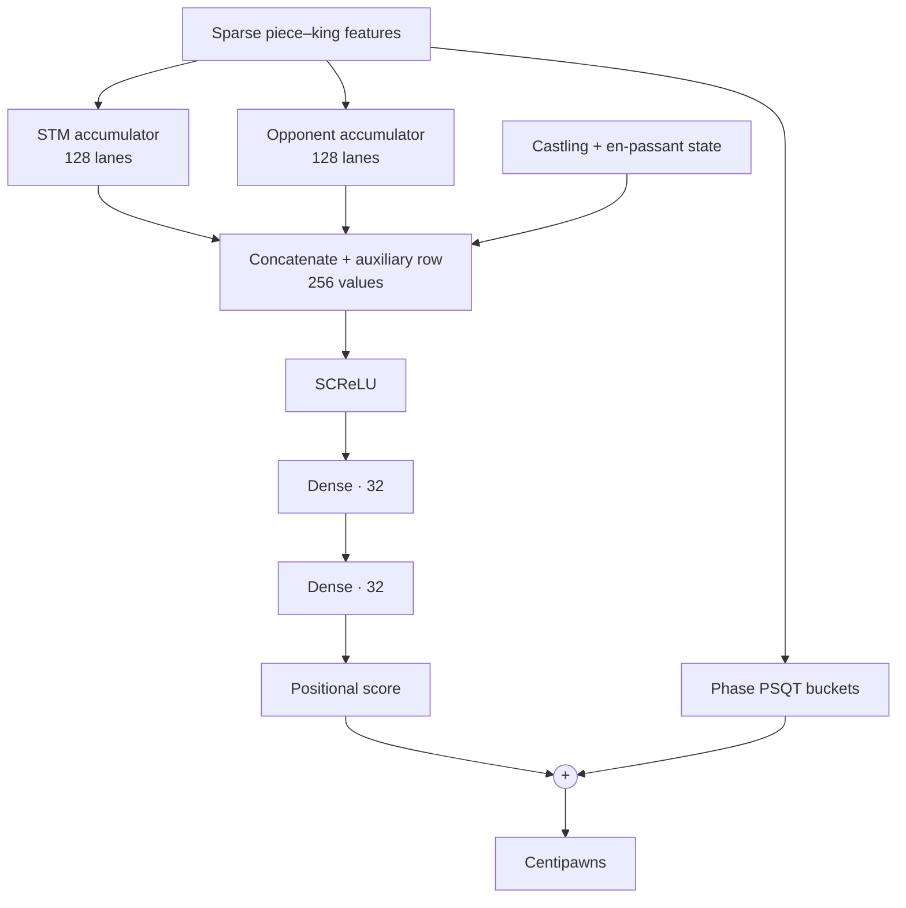
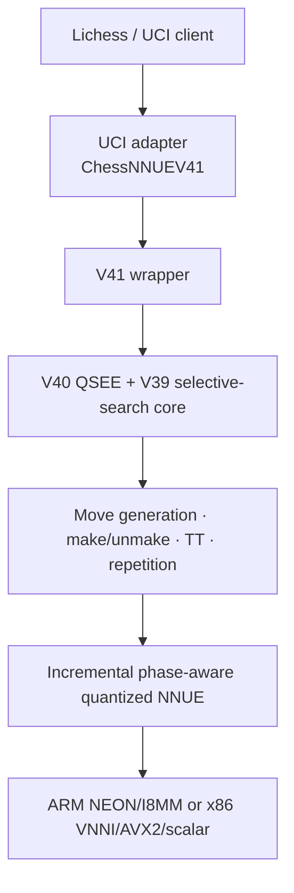

# Chess

A learning-oriented C++20 chess engine built from bitboards upward. The project
now includes a long classical-search lineage, phase-aware quantized NNUE,
selective V41 search, a UCI adapter, and a documented Lichess deployment.

The project goal is not to clone Stockfish directly. It is a staged engine
project for learning the core systems work behind chess engines: bitboards,
legal move generation, perft, search, evaluation, neural evaluation, profiling,
and production deployment.

This README is the thematic project story. The tracked
[benchmark index](docs/benchmarks/README.md) retains the versioned reports,
artifact hashes, negative experiments, and promotion-gate details that have
already been packaged for the repository.

## How milestone claims are classified

The repository deliberately keeps old searchers, benchmark tools, and negative
experiments. Each milestone claim therefore has two independent labels:

| Dimension | Typical labels | Question answered |
|---|---|---|
| Lifecycle | experimental, historically promoted, deployed, rejected | What did the project do with the change? |
| Evidence | validated, validated with caveats, reconstructed, incomplete, inconclusive | How strongly do the retained artifacts support the claim? |

These labels prevent a newer version or one isolated metric from being mistaken
for a stronger engine: lower model loss, fewer nodes, higher NPS, and playing
strength are different results. Interpreting a new performance or strength
claim requires pinned artifacts, workload, correctness signatures, and stopping
rule.

## Four project milestones

The project is easier to understand as four engineering milestones than as a
list of every searcher version. The version numbers still matter for
reproducibility, but each milestone marks a step change substantial enough to
redefine how the engine was designed, searched, evaluated, or trained, rather
than another incremental version.

| Milestone | Main question | Result |
|---|---|---|
| 1. Correctness, simple search, heuristic evaluation | Can the engine represent chess correctly and return a defensible move? | A legal bitboard engine, perft/tests, plain alpha-beta, and a material-plus-piece-square evaluator. |
| 2. Range-correct Strict search and clean optimization | How much search work can be removed while preserving the same fixed-depth score or a mathematically valid alpha-beta bound? | Bound-correct TT, PVS/re-search, ordering, fixed move storage, magic attacks, lazy/staged legality, make/unmake, and cache/layout work, with per-position score/move/node gates where evidence survives. |
| 3. Neural evaluation becomes both stronger and practical | Can an NN evaluator justify its much higher cost? | The historical NNUE beat the heuristic engine while searching one ply less; incremental accumulators and SIMD kernels then made NN inference production-viable. |
| 4. Controlled selective or “dirty” pruning | How aggressively can the engine prune unlikely moves without causing tactical blunders? | LMR, null move, RFP, LMP, and QSEE were evaluated on large position sets, safety banks, Pareto frontiers, and finally paired self-play. |

This README uses those four thematic milestones. The version names remain in
the source tree and Git history for finer-grained reconstruction; the four
groups here describe the engineering story rather than replacing those source
anchors.

## Detailed milestone history

### 1. Correctness, simple search, and a heuristic evaluator

The first milestone was not speed. It was building a position representation
that could be trusted.

The initial engine established:

- bitboards with `a1 = 0` and `h8 = 63`;
- FEN parsing and complete position state;
- pawn, knight, king, sliding, and occupancy-dependent attacks;
- pseudo-legal and legal move generation;
- castling, en passant, promotion, check, and legal handling of pinned-piece
  cases;
- `make_move` and known-count perft validation;
- material and piece-square evaluation;
- plain negamax alpha-beta search.

At this stage search copied a `Position` for each child. In-place undo state and
RAII make/unmake guards came much later, during the V20-V27 optimization wave.
That distinction matters: the first milestone proved rules and state
transitions before trying to make them cheap.

The evaluator was intentionally understandable:

> **Heuristic score** = material balance + piece-square terms

One chess point is represented as 100 centipawns (`cp`). The base material
values in the original evaluator were:

| Piece | Chess shorthand | Engine value |
|---|---:|---:|
| Pawn | 1 point | 100cp |
| Knight | 3.2 points | 320cp |
| Bishop | 3.3 points | 330cp |
| Rook | 5 points | 500cp |
| Queen | 9 points | 900cp |
| King | Not exchangeable | 0cp in static material |

The king does not need a capture value in normal evaluation because a legal
game ends at checkmate rather than with the king being captured. Checkmate is
therefore represented by the search as a separate terminal score, not as the
material value of a king.

Material alone would consider every square equivalent. The piece-square table
(`PST`) adds a small handcrafted bonus or penalty according to where each
piece stands. For example, a knight in the center can receive `+20cp`, while a
knight in a corner receives `-50cp`. The table is mirrored by color, so White
and Black receive the same preference from their own perspective.

Conceptually, the calculation was:

| Quantity | Calculation |
|---|---|
| Piece contribution | Base piece value + `PST[piece][relative square]` |
| White score | Sum of White contributions − sum of Black contributions |
| Side-to-move score | White score if White moves; otherwise, its negation |

Thus winning an otherwise equal rook changes the score by roughly `+500cp`,
whereas improving a knight's square might change it by only a few dozen
centipawns. This evaluator did not directly understand mobility, pawn
structure, threats, long-term king safety, or game phase beyond what the fixed
tables happened to encode. Alpha-beta search supplied tactical correction by
looking ahead; the heuristic supplied the leaf score when that lookahead
stopped.

It was fast, deterministic, and expressive enough to be a useful teacher and
control. The simple alpha-beta tests compared its score with a small full
negamax reference suite and checked that the returned move realized that
score. They did not establish identical node counts or a unique best move when
several moves tied.

This correctness-first core remains the foundation under every later Strict,
NNUE, and selective searcher.

### 2. Range-correct Strict search and clean optimization

The project uses **Strict** for a correctness/debug line intended to make
fixed-depth comparisons and score bounds easier to reason about while data
structures and hot paths change. It is an engineering intent, not a claim that
every historical Strict version has already been proven behavior-identical.
“Clean pruning” is useful shorthand, but there are three technically different
things inside this milestone:

1. **Proven cutoffs:** alpha-beta and valid TT bounds can skip a subtree because
   the current window already proves it irrelevant.
2. **Work reduction without dropping moves:** move ordering, fixed move lists,
   magic attacks, cached state, and staged/lazy legality retain the legal move
   space and score contract while reducing implementation work. Ordering and
   proof cutoffs may still change which nodes are visited.
3. **Correct re-search protocols:** PVS and aspiration may search a narrow
   window first, but re-search when the narrow result is insufficient.

These are different from milestone 4, where a heuristic intentionally decides
that a move probably does not deserve a full search.

V2-V13 were an exploratory search laboratory and already tried quiescence,
LMR, null move, PVS, history, and killers. Not all of those experiments were
behavior-preserving. V14 made bound behavior explicit; V15 introduced the
range-storing, exact-depth hand-written Strict line. V16-V33 and V35 then
concentrated the controlled TT, ordering, move-generation, state, and layout
work within this line. V34 branched into the Fast line to test a compact
single-bound TT with `AtLeast` depth reuse: a deeper result may accelerate the
search, but it is not guaranteed to equal the score requested at the shallower
fixed depth.
Aggressive LMR/null-move tuning is treated separately in milestone 4.

#### What “exact behavior” means in this repository

A fair Strict comparison pins the corpus, depth mode, compiler, flags, TT size,
and starting heuristic state, then checks the result per position:

- score equality is the primary semantic gate;
- tied-optimal moves must be handled explicitly before claiming best-move
  equality;
- node equality is not part of the Strict contract; it is required only before
  claiming the same node count or using equal nodes to isolate per-node speed;
- timing is interpreted only after the score contract and workload relationship
  are known.

The main Strict benchmark series therefore excludes V34. It may appear as a
separate Fast/experimental comparison, but its time, nodes, and NPS describe a
different fixed-depth computation and cannot be presented as a clean Strict
speedup.

#### Measured Strict milestone progression


#### How the benchmark was run

Every version searched the same 25 positions directly at fixed depths 6, 7,
and 8. For each `(depth, round, leg, position, version)` tuple, the harness
constructed a fresh 64 MiB searcher state outside the timer and measured only
the in-process `search_best_move` call. Eight Williams-balanced forward/reverse
rounds controlled execution-order effects, and every timed result had to match
V15's score, return a legal move, reach the requested depth, and finish without
stopping. The chart reports pooled depth-7 wall time from the same Apple M4
Release + ThinLTO build. All 9,600 timed searches passed; the six unique move
differences were force-verified as score-equivalent ties.

#### What each measured version introduced

Because the selected checkpoints skip intermediate versions, each row reports
only the accumulated change since the previous measured checkpoint.

| Version | Main improvement | Move ordering |
|---|---|---|
| V15 | Baseline: hand-written Strict search with exact-depth range TT. | Baseline weighted ordering: preferred TT move, promotions, SEE, history, checks, and two killers. |
| V19 | Bucketed range TT, cached king safety, and legality filtered while scoring pseudo-legal moves. | Separately weight the lower/upper TT moves and add counter-history. |
| V23 | **Two-stage lazy move generation.** | Search the lower TT move first; generate noisy moves next and quiet moves only if still needed. |
| V25 | Fixed-capacity raw storage replaces heap-backed scored-move vectors. | Replace noisy/quiet stages with a priority stage for promotions and non-losing captures, followed by quiets and deferred losing captures. |
| V27 | In-place make/unmake with undo state and RAII replaces child-position copies. | No deliberate ordering change. |
| V29 | Dedicated legal callbacks complete **fully staged lazy move generation**. | Split the remaining moves into four on-demand stages: promotions → good captures → quiet moves → bad captures. |
| V30 | `ScoredMove` is packed from 16 to 8 bytes and the templated search hot path is rewritten. | Replace qsearch SEE ordering with cheaper victim/attacker scoring; main-search stages are unchanged. |
| V35 | Compact 12-byte TT preserves score ranges and exact-depth reuse. | Insert a priority quiet stage for two killers and the countermove before general quiet moves. |

These labels explain why each checkpoint was selected. The measured difference
between two rows still includes every accumulated change between them; it is
not an isolated one-feature A/B.

- **Interpretation:** elapsed time is primary and NPS explains per-node cost.
- **Provenance:** these are stable current-tree reconstruction results, not
  timings from the original historical binaries.

### 3. Neural evaluation becomes stronger and fast enough to use

#### Why I initially doubted the NN

I was initially skeptical that a neural evaluator was worth its cost. The
heuristic evaluator was extremely cheap, easy to debug, and already expressive
enough to describe material and many positional ideas. A neural evaluator is
called throughout the search tree, so a slow forward pass can erase any gain
from a better position score.

Early scalar inference reinforced that concern. The turning point was not just
training a model with lower loss. It was the combination of:

- a model that made better positional decisions;
- incremental features, so most moves update a few rows instead of rebuilding
  the whole input;
- quantized arithmetic;
- architecture-specific dot-product intrinsics.

The result was substantially stronger than I expected.

#### First match win over the heuristic engine

Across 200 games, the historical `hs2x8_os128` NNUE at depth 3 scored
**56.0%** against `HeuristicSearcherV35` at depth 4: 46 wins, 132 draws, and
22 losses, with a nominal paired 95% interval of 52.75%-59.25%. It searched
29.0M nodes in total, compared with 79.2M for the heuristic engine.

That result changed the project direction: the NN won while searching one ply
less. The ordinary interval was inspected every five pairs and the run used an
early-stop rule, so it is directional historical promotion evidence, not a
modern sequential Elo proof. The winning model was also an older artifact, not
the current production model described below.

See [the full NNUE-vs-heuristic result](docs/nnue_vs_heuristic_result.md).

#### How the NN works

##### Phase-aware F2 architecture

The board is encoded as sparse feature indices instead of a dense tensor. For
each active piece and king perspective, the encoder records:

| Feature component | Possibilities |
|---|---:|
| Piece type | 6 types |
| Piece side relative to perspective | 2: friendly or enemy |
| Perspective king square | 64 squares |
| Piece square | 64 squares |

This gives `6 × 2 × 64 × 64 = 49,152` possible feature rows. The same
table is shared by the side-to-move and opponent perspectives. Each active row
contributes 128 values to its perspective accumulator; the two accumulators are
then concatenated into 256 dense inputs.

Thirteen auxiliary inputs encode castling rights, en-passant availability, and
the en-passant file without creating another large sparse table.



Other architectural details:

- eight material-phase dense heads;
- eight PSQT buckets accumulated alongside the positional rows;
- king moves rebuild only the affected king perspective;
- ordinary moves incrementally add/subtract feature rows;
- `int8` weights with wider accumulators and bit-exact scalar/SIMD parity;
- production scales `(hidden2=2, hidden3=8, output=128)`, clip `181`, and
  SCReLU divisor `128`.

##### The NEON kernel made the model operational

The hot mixed-sign dot product maps directly to the ARM NEON/I8MM intrinsic
`vsudotq_laneq_s32` (the `SUDOT` instruction).

It multiplies unsigned activation bytes by signed weight bytes and accumulates
the products into `int32` lanes. The ARM kernel is compiled natively with NEON,
dot-product, and I8MM support, while the scalar reference remains the bit-exact
correctness oracle.

The standalone NNUE prototype went through many small kernel experiments, but
those implementation checkpoints are not promoted to project milestones here.
The important progression was architectural: map quantized inference to native
mixed-sign dot products, keep SCReLU and dense accumulation vectorized, and
decompose wider activations into low/high byte banks that the same dot-product
instructions can consume.

Microbenchmarks decided which implementations survived. Several intuitive
manual pipelines, paired-load loops, and algebra rewrites were neutral or even
slower because they increased dependency chains or forced accumulator spills.
That negative evidence is useful engineering history, but the main milestone
is the resulting bit-exact NEON kernel rather than every intermediate rewrite.

### 4. Controlled selective (“dirty”) pruning

Strict search asks, “what result does this finite-depth search define?”
Selective search asks, “which work is unlikely to change the move enough to be
worth its cost?” The second question is deliberately approximate. In this
README, **dirty pruning** means a heuristic can skip or reduce work without a
mathematical guarantee that the finite-depth score remains identical.

#### Pruning mechanisms

| Mechanism | What it does | Main failure mode |
|---|---|---|
| LMR | Reduces only sufficiently late, quiet, non-capture, non-promotion, non-checking moves while not in check; a reduced score range that may exceed alpha is re-searched at full depth | A genuinely strong late move may look harmless at reduced depth and never earn the re-search. |
| Null-move pruning (NMP) | Gives the side to move a synthetic pass and makes a null-window search; it is disabled in check, inside another null search, and when the side has no non-pawn material | Zugzwang and positions where the obligation to move is itself harmful. This implementation has no verification search. |
| Reverse futility pruning (RFP) | At shallow non-PV nodes, outside check, null searches, and mate windows, cuts off when static evaluation exceeds beta by a depth-dependent margin; it is also disabled when the side to move has no non-pawn material | Tactical resources can invalidate the static margin. |
| Late-move pruning (LMP) | At shallow null-window nodes, skips ordinary quiet moves after `base + multiplier × depth²`; captures, promotions, and earlier priority stages have already been handled | A late quiet tactic or only move can be discarded. |
| Quiescence SEE pruning (QSEE) | Skips a non-checking, non-promotion capture only when `SEE < threshold`; checking captures, promotions, and evasions remain | A superficially losing sacrifice can be positionally or tactically correct. |

#### Evaluation was a pipeline, not one benchmark

The V38/V39 tuner compared each candidate with the finite-depth V36 Strict
control over thousands of positions. When a candidate selected a different
root move, that control re-searched the move and measured **root regret**:

> **Root regret** is the score lost relative to the Strict move:
> `max(0, best Strict score − candidate-move Strict score)`.

This is disagreement with a pinned finite-depth teacher, not objective chess
error. V36 itself ends in a finite capture quiescence search, so a low regret
is useful selection evidence rather than proof that the move is best chess.

The active adversarial LMR/NMP pipeline was organized into six stages:

| Stage | Evaluation step |
|---|---|
| Prepare data | Mine and deduplicate the historical safety bank; create 16,000 fresh positions: 8k tune, 4k selection, and 4k holdout. |
| Core safety | Run the visible safety gate at depths 5–8 and a fixed 2,000-position tune-split gate at depth 6. |
| Build the frontier | Keep the per-lineage Pareto frontier over node count and root regret. |
| Sealed selection | Evaluate candidates against the sealed adversarial set at depth 7. |
| Fresh validation | Use a fresh 4,000-position selection set and a fresh 4,000-position holdout set, then re-audit at most eight spread points at depth 8. |
| Final promotion | Apply the later WDL and RFP/LMP selection, then decide by paired, color-reversed self-play. |

Safety was not reduced to average CP loss:

- a Strict score of at least `+500cp` becoming `[-100,+100]` was win-to-draw;
- a Strict score of at least `+500cp` becoming less than `-100cp` was
  win-to-loss;
- a candidate move becoming mate-losing while the control was above `-100cp`
  was self-mate;
- any of those three events was a hard rejection, not an averaged penalty;
- six known critical rows plus 32 mined `>=250cp` near misses formed a
  38-position hash-deduplicated bank: 24 mutation-visible `core` rows and 14
  sealed rows; 41 configurations failed the core gate;
- mean regret was ranked only where the direct static NNUE target satisfied
  `|static_target_cp| < 1500`, but every position remained eligible for the
  hard safety checks;
- p95 regret, the fraction above `100cp`, move agreement, and prune counters
  were reported alongside the mean;
- tune, selection, and holdout sets were kept separate.

Those numerical hard thresholds belong to this adversarial CP-regret
pipeline. Later WDL/all-position experiments used different objectives, so the
README does not present them as universal definitions of chess safety.
The exact 38-row/41-rejection counts come from a locally retained historical
run; the tracked repository preserves the method and definitions more durably
than it preserves every raw intermediate artifact.

#### Depth-8 re-audit of selected node/regret trade-offs

The rows below were selected as spread points earlier in the pipeline and then
re-audited at depth 8 on 4,000 paired holdout positions. They are not all a
freshly recomputed depth-8 Pareto set: one can become dominated when the depth
changes. Control nodes vary slightly because each candidate was paired with
its own Strict run. Node totals and the critical gate use all 4,000 positions;
mean regret, p95, and above-100cp use the 3,743 ranking positions that passed
the static-target filter. The other 257 positions still participate in safety
checking. “Critical” is the hard self-mate/win-to-draw/win-to-loss gate.

| Candidate | Candidate / control nodes | Node ratio | Mean regret | P95 regret | Above 100cp | Critical |
|---|---:|---:|---:|---:|---:|---:|
| LMR `.45/2.65`, d5/i5 + NMP d3/r1 | 2.886B / 11.224B | 25.71% | 7.96cp | 46cp | 1.95% | 0 |
| LMR `.45/2.45`, d5/i3 | 3.517B / 11.242B | 31.29% | 6.90cp | 40cp | 1.68% | 0 |
| LMR `.50/2.55`, d5/i7 + NMP d5/r2 | 3.154B / 11.285B | 27.94% | 6.74cp | 40cp | 1.52% | 0 |
| LMR `.55/2.80`, d5/i8 + NMP d6/r2 | 3.884B / 11.309B | 34.35% | 5.55cp | 30cp | 1.26% | 0 |
| NMP d4/r1 | 7.257B / 11.190B | 64.85% | 1.55cp | 2cp | 0.27% | 0 |
| NMP d5/r1 | 8.951B / 11.224B | 79.75% | 0.93cp | 0cp | 0.08% | 0 |
| Strict control | 11.317B / 11.317B | 100.00% | 0.00cp | 0cp | 0.00% | 0 |

This table explains why there is no single “best pruning score.” The aggressive
end saves roughly three quarters of the nodes at the cost of more teacher
disagreement; the conservative end preserves the Strict decision more often
but saves less. The frontier process exists to keep those trade-offs visible,
while the final decision still belongs to direct play.

This table is directional historical evidence. Its raw summary is local and
Git-ignored, lacks a complete source/binary identity, and predates the tracked
per-sample heuristic-reset marker; independent heuristic reset for this run is
therefore not proven.

#### Selection and self-play

The historically promoted V39 `Fast` profile was:

| Mechanism | Promoted settings |
|---|---|
| LMR | Base `0.45`; divisor `2.9`; minimum depth `3`; minimum move index `6` |
| NMP | Minimum depth `2`; reduction `3` |
| RFP | Maximum depth `2`; base margin `175`; margin per depth `275` |
| LMP | Maximum depth `3`; base `4`; depth multiplier `2` |

The LMR move index is zero-based, so index `6` means the seventh searched move.
For LMP, the searched-move threshold is `4 + 2 × depth²`; captures,
promotions, and priority quiets can already have advanced that counter before
the ordinary quiet stage is considered for pruning.

Its final decision came from paired, color-reversed games rather than the
offline frontier alone:

| Match | Fast W-D-L | Fast score | Historical decision |
|---|---:|---:|---|
| Fast vs Balanced | 21-59-10 | 56.11% | Favor Fast |
| Fast vs baseline7 | 20-55-9 | 56.55% | Favor Fast |
| Fast vs later all-four offline winner | 21-59-10 | 56.11% | Reject the offline winner; keep Fast |

`baseline7` kept the tuned LMR/NMP base but disabled RFP and LMP, isolating the
newer pruning pair. The final row is reported from Fast's perspective; it is
the reciprocal of the raw all-four candidate result `10-59-21`.

Those matches repeatedly inspected an ordinary confidence interval and stopped
when it first excluded 50%; search heuristics also leaked between games. They
record the project's historical promotion decision, but are directional rather
than confirmatory statistics.

The all-four candidate is the useful warning here: it won the offline
selection and fixed-time holdout, then lost its direct match to Fast. The
Strict teacher, regret frontier, and safety bank are powerful filters; none
replaces self-play as the final promotion gate.

V40 then tuned QSEE over `OFF, -600, ... , -75, -50, -25, 0`. On a fresh
6,000-position depth-8 holdout, QSEE-off had the lowest WDL loss, `0` used the
fewest nodes, and the project chose `-75cp` as an interior frontier compromise.
At `-75cp`, nodes fell by `15.50%` and time by `11.36%`. The 600-game match
scored `52.0%` with CI `49.71%-54.29%`, so QSEE was adopted for measured
efficiency, not a proven strength win or a uniquely optimal scalar threshold.

V41 added in-search threefold and 50-move handling, plus TT-score suppression
when the score depends on reversible history. Those are correctness guardrails
around the selected search, not another pruning-strength claim.

See the [selective-search pipeline](docs/nnue_selective_adversarial_pipeline.md)
for the tracked candidate flow and safety-bank method.

### Evidence discipline and negative results

The milestone story intentionally retains results that did not become wins:

- V18/V19's historical timing ratio is not presented as exact-tree proof;
- the V39 all-four offline candidate lost its direct match to Fast;
- V40 QSEE improved efficiency but not conclusively playing strength;
- the ordinary 500M F2 candidate scored `47.08%` against the older 200M
  reference over 600 games and was rejected;
- horizontal mirroring improved controlled offline error, but the longer F2M
  self-play run scored `50.92%`, with CI `48.39%-53.44%`, and did not
  demonstrate a playing-strength improvement. No F2M model was promoted.

The model-scaling experiments remain documented in the
[model-scaling report](docs/benchmarks/nnue_model_scaling_20260825.md), but they
are not a project milestone because they did not improve the deployed engine.

## Current engine architecture

The production path now looks like this:



Key implementation properties:

- C++20, bitboards and magic sliding attacks;
- legal noisy/quiet generators and staged move ordering;
- iterative deepening, alpha-beta/PVS, quiescence, null-move pruning, LMR,
  history, killer and counter-history heuristics;
- bucketed transposition tables;
- incremental NNUE accumulator state with phase and PSQT terms;
- UCI options for move overhead and selective-search controls;
- a containerized Lichess worker that starts a fresh UCI engine per game.

In the last documented committed UCI lifecycle, both `ucinewgame` and every
`position` command clear TT. `ucinewgame` does not perform a complete reset of
all learned search heuristics. Clearing on each `position` is safe for
history-dependent draw scores but prevents cross-move TT reuse. The working
tree contains an experimental generation-tag design in which older entries may
provide move hints but not score cutoffs; it is not a committed or benchmarked
production milestone.

### Last documented production snapshot

The last documented production snapshot is V41 at commit `634b2d4`; the
retained deployment observation records Heroku release v12 on 2026-08-25.
This README does not treat that observation as proof of live state on a later
date without a fresh provider query.

- V39 Fast selective-search baseline
- V40 quiescence SEE pruning at `-75cp`
- V41 in-search threefold-repetition and 50-move rules
- phase-aware quantized F2 NNUE model
- native-build ARM I8MM/NEON and runtime-dispatched x86 AVX2/AVX-512 VNNI
- Release plus LTO Heroku build

The documented production model is 7,944,336 bytes; its SHA-256 is
`a1a52891f95db9a1bacc48557325b0c5904da4b3c9f8a333eb2ec090b1bb9c02`.
The canonical same-signature benchmark measures 4.71-4.94M fixed-depth NPS on
the local Apple M4 and 1.48-1.58M NPS on the Heroku LTO release. This ratio is a
cross-platform operational comparison, not isolated hosting overhead.

## Repository guide

| Path | Purpose |
|---|---|
| `include/`, `src/` | Chess core, versioned searchers, TT implementations and NNUE runtime. |
| `tests/`, `tests_py/` | C++ correctness/parity tests and Python harness/analyzer tests. |
| `tools/` | Dataset export, tuning, UCI adapters, matches, benchmarks, profilers and evidence analyzers. |
| `nn/` | Training architectures, loaders, targets and quantization/export support. |
| `benchmarks/` | Versioned canonical position suites. |
| `deploy/` | Heroku/Lichess packaging and staging workflows. |
| `docs/benchmarks/` | Curated benchmark reports, protocol and compact evidence manifests. |

## Historical parallel branch: dense neural value evaluation

This section preserves the first dense value-network pipeline. It is useful
project history, but it does **not** describe the current production NNUE. The
production architecture is the phase-aware quantized `256 -> 32 -> 32 -> 1`
network described in the milestone and benchmark reports.

The prototype NN was a value model that mapped each position to a scalar score
from the side-to-move perspective. It did not output policy or move
probabilities.

### NN Architecture

The prototype used an earlier form of the sparse encoding above. It stored the
friendly-king and enemy-king contexts as separate groups, giving
`6 × 2 × 2 × 64 × 64 = 98,304` possible feature indices. Its network was
intentionally small:

- `EmbeddingBag`: 98,304 sparse features → a 256-dimensional embedding;
- concatenate the auxiliary features;
- `Linear` → ReLU → `Linear` → scalar output.

This was a pipeline test model, not the final NNUE.

### Training Target

The prototype model learned from the classical engine itself.

Dataset labels came from `search_best_move(position, depth).score`. That score
combined the classical heuristic evaluation with tactical correction from
shallow alpha-beta search. The prototype therefore learned the heuristic
evaluation together with shallow-search behavior.

It is not expected to exceed the teacher automatically. A stronger model must be accepted only after match testing against the previous model.

### Self-Play Training Loop

The intended promotion loop was:

1. Freeze the current model as `model_old`.
2. Generate games using `model_old` plus search.
3. Train `model_new`.
4. Match `model_new` against `model_old`.
5. Promote `model_new` only if it wins clearly.

This prevents blindly replacing the engine with a model that only has lower training loss.

## Build

With CMake:

```sh
cmake -S . -B build -DCMAKE_BUILD_TYPE=Release
cmake --build build --target \
  uci_nnue_v41 \
  search_tests \
  nnue_searcher_v41_repetition_tests \
  phase_quantized_nnue_tests \
  -j
```

On this machine, if `cmake` is not on `PATH`, use:

```sh
/opt/homebrew/Cellar/cmake/4.2.0/bin/cmake -S . -B build -DCMAKE_BUILD_TYPE=Release
/opt/homebrew/Cellar/cmake/4.2.0/bin/cmake --build build --target \
  uci_nnue_v41 \
  search_tests \
  nnue_searcher_v41_repetition_tests \
  phase_quantized_nnue_tests \
  -j
```

Run tests:

```sh
ctest --test-dir build --output-on-failure \
  -R '^(search_tests|nnue_searcher_v41_repetition_tests|phase_quantized_nnue_tests)$'
```

The default all-target build currently also includes optional TT-stat profiling
executables whose link mode is inconsistent when TT stats are disabled. The
production and test targets above build normally; fixing the optional-profile
target wiring remains an explicit build-system cleanup item.

The V36-V41/phase-parity tests also require the production model and parity TSV
at the documented `models/quantized_scale_grid/.../best/` path. Those large
artifacts are currently ignored by Git, so a clean clone needs them restored by
hash before running the NNUE tests. The milestone manifest records the model
SHA-256; long-term artifact hosting is still required for one-command clean
reproduction.

Start the current UCI engine with its default model path:

```sh
build/uci_nnue_v41
```

Or pass a model explicitly:

```sh
build/uci_nnue_v41 \
  models/quantized_scale_grid/old_score_huber200_lr_sweep_then_5ep_20260724_142758/best/phase_quantized_nnue.bin
```

Example UCI session:

```text
uci
isready
ucinewgame
position startpos
go depth 8
quit
```

## Historical dense-model dataset export

Build the dataset exporter:

```sh
cmake --build build --target dataset_export -j
mkdir -p data
```

Generate game states with random opening plies, then engine-selected moves:

```sh
build/dataset_export \
  --games 1000 \
  --depth 2 \
  --random-plies 4 \
  --max-plies 60 \
  --progress-interval 100 \
  --seed 1001 \
  --output data/value_games.jsonl
```

## Historical dense-model training from saved JSONL

```sh
.venv/bin/python -m nn.train_value \
  --train data/value_train.jsonl \
  --val data/value_val.jsonl \
  --test data/value_test_baseline.jsonl \
  --epochs 10 \
  --batch-size 1024 \
  --device cpu \
  --output models/value_net.pt
```

The `--test` file is a held-out baseline. It is not used for training.

## Historical dense-model stream training

For large self-play runs, training data should not be fully written to disk.

Use streaming:

```sh
build/dataset_export \
  --games 100000 \
  --depth 2 \
  --random-plies 4 \
  --max-plies 60 \
  --progress-interval 1000 \
  --seed 1001 \
  --output /dev/stdout \
  | .venv/bin/python -m nn.train_stream_value \
      --val data/value_val_1k_stream.jsonl \
      --test data/value_test_baseline_1k_stream.jsonl \
      --batch-size 1024 \
      --device cpu \
      --output models/value_net_stream.pt \
      --log-interval 100000 \
      --eval-interval 1000000
```

This keeps train data out of disk. Only validation/test baseline files are stored.

## Historical dense-model export for C++ inference

PyTorch is only needed for training and exporting. Runtime inference in the engine uses a small C++ forward pass.

Export a trained checkpoint:

```sh
.venv/bin/python tools/export_value_net.py \
  --checkpoint models/value_net_stream_100k.pt \
  --output models/value_net_stream_100k.bin \
  --compare-input data/value_test_baseline_1k_stream.jsonl \
  --compare-output data/nn_value_compare_1000.jsonl \
  --compare-limit 1000
```

Build and run the C++ parity test:

```sh
cmake --build build --target nn_value_tests -j

build/nn_value_tests \
  models/value_net_stream_100k.bin \
  data/nn_value_compare_1000.jsonl
```

The test compares C++ inference against Python/PyTorch output on encoded samples.

## Historical dense-model search engine

Build the standalone NN search engine:

```sh
cmake --build build --target nn_engine -j
```

Search one position:

```sh
build/nn_engine \
  --model models/value_net_stream_100k.bin \
  --depth 3 \
  --go-once
```

Use a custom FEN:

```sh
build/nn_engine \
  --model models/value_net_stream_100k.bin \
  --depth 3 \
  --fen "rnbqkbnr/pppppppp/8/8/4P3/8/PPPP1PPP/RNBQKBNR b KQkq - 0 1" \
  --go-once
```

Without `--go-once`, it starts an interactive CLI where the NN engine plays Black.

## Current Direction

The next serious milestones are:

- benchmark a register-fused x86 VNNI forward candidate against the current
  kernel on the same dynos, with forced-backend parity before changing `auto`;
- finish and benchmark safe cross-search TT reuse with a persistent UCI process;
- make the self-play harness reset all search state and pin every artifact hash;
- run a provenance-complete V41-versus-V39 strength match if that historical
  comparison is still needed;
- re-run the full clean suite after the V21-V23 TT-range repair, and fix the
  optional TT-profile build wiring;
- archive selected raw benchmark bundles outside ignored local directories.

New models are promoted only after distinct parity, offline-quality,
throughput, and paired playing-strength gates.
